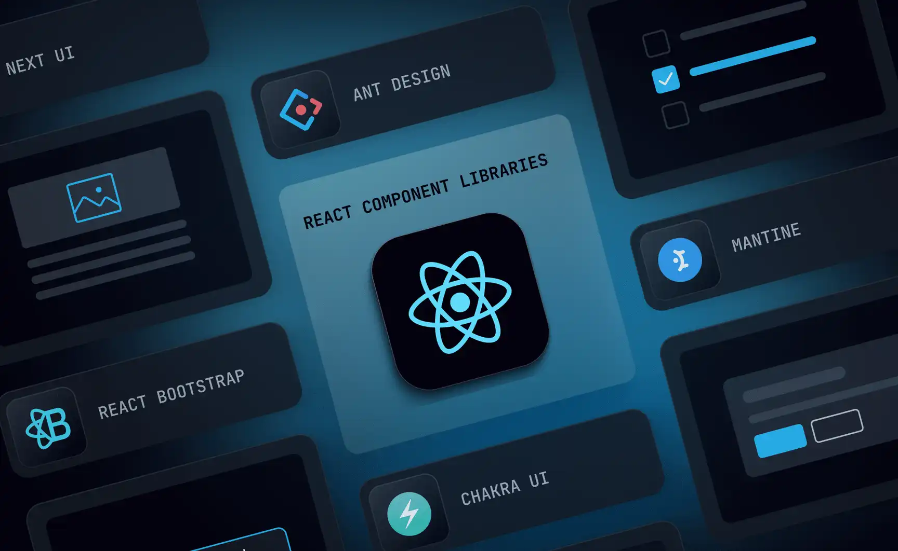

# Synthra UI Kit



Biblioteca de componentes React construída sobre o [MUI](https://mui.com), com tema, tokens e componentes prontos para dashboards, sistemas B2B e aplicações públicas.

## Instalação

A biblioteca usa as mesmas instâncias de React, MUI e Emotion da sua aplicação, então elas são instaladas como dependências do projeto:

```bash
pnpm add @synthra.io/ui-kit @mui/material @mui/x-data-grid @emotion/react @emotion/styled react-hook-form
```

A tipografia usa a fonte **Lato**, que precisa ser carregada pela aplicação (Google Fonts, `next/font`, `@fontsource/lato`…).

## Uso

Envolva a aplicação com o `Provider`:

```tsx
import { Provider, Button } from '@synthra.io/ui-kit';

export function App() {
  return (
    <Provider>
      <Button variant="contained" onClick={() => {}}>
        Salvar
      </Button>
    </Provider>
  );
}
```

O `Provider` aplica o tema e o `CssBaseline` do MUI. Se a aplicação já tiver o próprio reset de CSS, use `<Provider cssBaseline={false}>`.

### Next.js (App Router)

Use o entry `@synthra.io/ui-kit/next`. Ele coleta os estilos no SSR e configura o `next/link` como componente de navegação de `Link`, `Button`, `Tab`, `ListItemButton` etc.

```tsx
// app/layout.tsx
import { GlobalLayoutContainer } from '@synthra.io/ui-kit/next';

export default function RootLayout({ children }: { children: React.ReactNode }) {
  return <GlobalLayoutContainer>{children}</GlobalLayoutContainer>;
}
```

Se o layout já renderiza `<html>` e `<body>`, use `<ThemeRegistry>` no lugar do `GlobalLayoutContainer`. Para abas ligadas à rota atual, importe `TabBar` de `@synthra.io/ui-kit/next`.

### Outros roteadores (React Router, TanStack Router…)

Os componentes de navegação aceitam `href` e usam o componente de link configurado no tema, seguindo o [padrão do MUI](https://mui.com/material-ui/integrations/routing/):

```tsx
import { Link as RouterLink } from 'react-router-dom';
import { initializeTheme, Provider } from '@synthra.io/ui-kit';

const LinkBehavior = React.forwardRef<HTMLAnchorElement, any>(({ href, ...props }, ref) => (
  <RouterLink ref={ref} to={href} {...props} />
));

const theme = initializeTheme({
  overrides: {
    components: {
      MuiLink: { defaultProps: { component: LinkBehavior } },
      MuiButtonBase: { defaultProps: { LinkComponent: LinkBehavior } }
    }
  }
});

<Provider theme={theme}>{/* ... */}</Provider>;
```

## Tema

`initializeTheme` gera o tema com os tokens, a tipografia e os overrides da Synthra:

```tsx
import { initializeTheme } from '@synthra.io/ui-kit';

// Modo escuro
const dark = initializeTheme({ mode: 'dark' });

// White-label: troque a identidade visual sem alterar componentes
const brand = initializeTheme({
  overrides: { palette: { primary: { main: '#7C3AED' } } }
});

// Textos internos do MUI em inglês (o padrão é pt-BR)
const en = initializeTheme({ locales: [] });
```

Os temas prontos `light` e `dark` também são exportados.

## Formulários

`FormProvider` integra os campos `TextFormField`, `SelectFormField`, `CheckboxFormField` e `AutocompleteField` ao react-hook-form. A validação vem pela prop `resolver`, com a biblioteca de sua escolha (instale `@hookform/resolvers` e o validador, ex.: `zod`):

```tsx
import { zodResolver } from '@hookform/resolvers/zod';
import { FormProvider, TextFormField, Button } from '@synthra.io/ui-kit';

<FormProvider resolver={zodResolver(schema)} defaultValues={{ nome: '' }} onSubmit={salvar}>
  <>
    <TextFormField name="nome" label="Nome" required />
    <Button type="submit">Salvar</Button>
  </>
</FormProvider>;
```

As mensagens de erro aparecem no `helperText` do campo e são associadas ao input para leitores de tela.

## Desenvolvimento

| Comando | Descrição |
| --- | --- |
| `pnpm storybook` | Storybook em http://localhost:6006, com alternância de tema light/dark na toolbar |
| `pnpm lint` | ESLint |
| `pnpm typecheck` | Checagem de tipos |
| `pnpm build` | Build da biblioteca em `dist/` |

### Fluxo de Pull Request

1. Faça as alterações e rode `pnpm changeset` para descrever a mudança (patch, minor ou major).
2. Commite. O hook de pre-commit exige um changeset e roda lint e typecheck.
3. Abra o PR. O workflow de CI roda lint, typecheck e os builds da biblioteca e do Storybook.

### Publicação

A publicação é feita pelo workflow `.github/workflows/release.yml` ao fazer merge na `master`:

1. Com changesets pendentes, o workflow abre (ou atualiza) um PR **"chore: version packages"** com a nova versão e o CHANGELOG.
2. Ao fazer merge desse PR, a nova versão é publicada no npm.

O workflow usa **Trusted Publishing** (OIDC), então não há token do npm armazenado no repositório. Para ativar, configure uma vez no npm: _npmjs.com → pacote `@synthra.io/ui-kit` → Settings → Trusted Publisher → GitHub Actions_, com o repositório e o workflow `release.yml`.

## Licença

MIT
